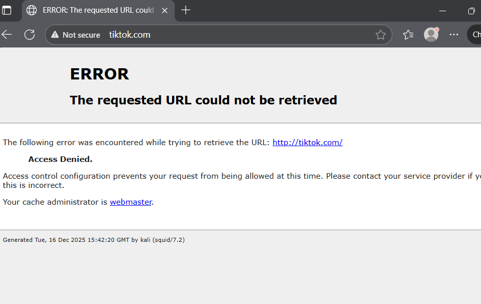
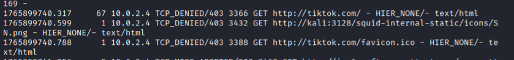
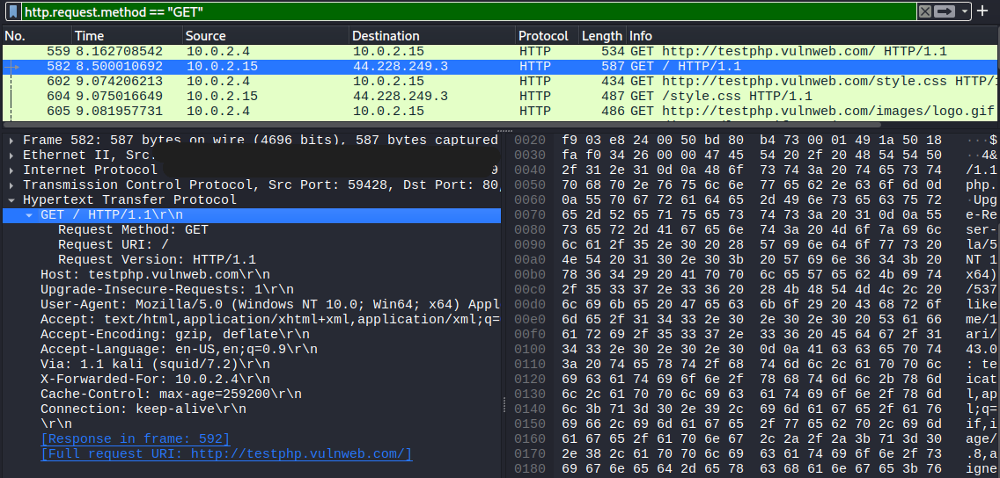
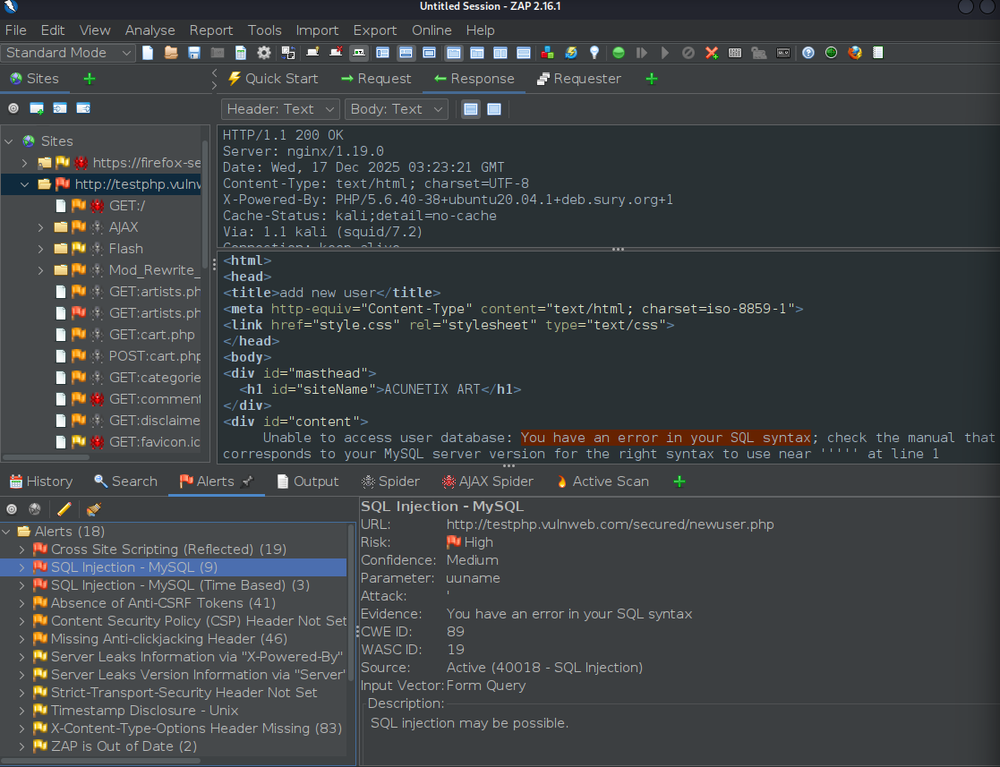
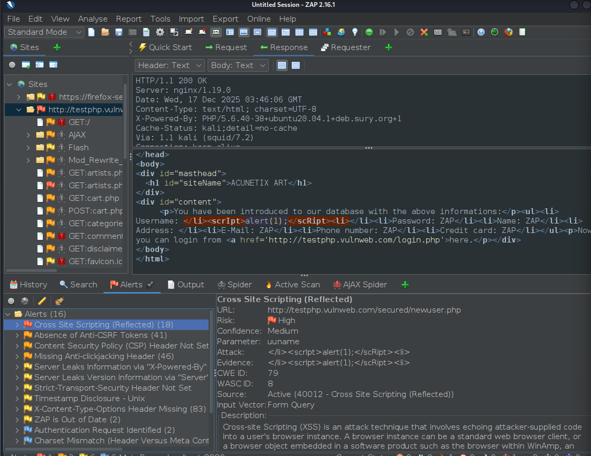

# Secure Web Gateway & Network Traffic Analysis Project


## 📌 Project Overview
This project demonstrates the design and deployment of a **Secure Web Proxy Server** using **Squid** on Kali Linux. The objective was to simulate a corporate network environment where internet access must be filtered, monitored and audited for security compliance.

The system enforces strict Access Control Lists (ACLs) to block non-productive websites (Social Media) and utilizes **Deep Packet Inspection (DPI)** and **Vulnerability Assessment** tools to analyze the allowed traffic.


## 🏗️ Network Architecture
The project was built using a virtualized internal network:
*   **Proxy Server:** Kali Linux (IP: `10.0.2.4`, Port: `3128`)
*   **Client Workstation:** Windows 11 (Routed via Proxy)
*   **Connection:** VirtualBox NAT Network (Isolated Internal Traffic)


##  ⚙️ Configuration (Squid ACLs)
The core security logic is defined in `squid.conf`. Below is the configuration used to enforce policies:

```squid
# --- CUSTOM PROJECT RULES ---

# 1. Network Definition
acl project_network src 10.0.2.0/24

# 2. Blocked Domains (Social Media)
acl blocked_sites dstdomain .tiktok.com .facebook.com

# 3. Blocked Keywords (Regex)
acl bad_keywords url_regex -i gambling betting casino

# --- ACTION EXECUTION ---
# Deny rules must be placed BEFORE allow rules
http_access deny blocked_sites
http_access deny bad_keywords
http_access allow project_network 
```

##  📸 Project Evidence & Analysis
1. Access Control & Logging
Objective: To verify that the Access Control Lists (ACLs) successfully block restricted domains.
Analysis:
The screenshot below shows a dual verification:
Client Side: The browser receives an "Access Denied" error when attempting to visit TikTok.
Server Side: The Squid logs record the attempt with a TCP_DENIED/403 status code, proving the ACL is active and enforcing the policy.





2. Deep Packet Inspection (Wireshark)
Objective: To confirm traffic routing and inspect HTTP headers added by the proxy.
Analysis:
We captured a request to testphp.vulnweb.com.
Proxy Header Injection: The capture highlights the Via: 1.1 kali (squid/7.2) header. This confirms that the request did not go directly to the internet but was processed by our specific proxy server.
Protocol: The traffic is visible as Cleartext HTTP/1.1, allowing for content inspection.




3. Vulnerability Assessment: SQL Injection
Objective: To audit "allowed" traffic for database vulnerabilities using OWASP ZAP chained through the proxy.
Analysis:
ZAP detected a High-Severity SQL Injection vulnerability on the test target.
Evidence: The screenshot shows ZAP successfully injecting a syntax error into the MySQL database.
Route: This attack was tunneled through the Squid Proxy (127.0.0.1:3128), demonstrating that the proxy allows the traffic flow, necessitating additional application-layer security.




4. Vulnerability Assessment: Cross-Site Scripting (XSS)
Objective: To test for client-side script execution vulnerabilities.
Analysis:
ZAP identified a Reflected XSS vulnerability.
Payload: The tool injected <script>alert(1);</script> into the input field.
Result: The server reflected the payload back without sanitization. This highlights the importance of scanning allowed web traffic for malicious scripts that could compromise client browsers.




##  🚀 How to Replicate
Install Squid: sudo apt update && sudo apt install squid -y

Edit Config: Add ACL rules to /etc/squid/squid.conf.

Restart Service: sudo systemctl restart squid.

Configure Client: Set Windows Proxy settings to the Kali IP address on port 3128.


##  ⚠️ Disclaimer

This project was conducted in a controlled virtual environment for educational purposes. All vulnerability scans were performed on authorized testing applications (testphp.vulnweb.com).

